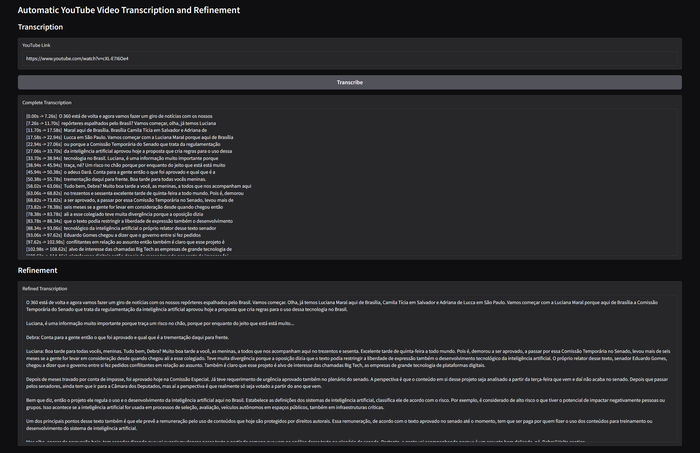

# Automatic YouTube Video Transcription and Refinement 🚀



This project provides a Gradio web interface that automatically downloads audio from a YouTube video, transcribes it using the **faster-whisper (small)** model, and then refines the transcription with a language model (**ChatOllama**, model: `"gemma3:12b"`). The process uses independent progress bars to display the status of each stage.

> **Note:**  
> Sensitive details (e.g., local file paths) have been omitted. Please update the configuration in the code according to your environment.


## Features ✨

- **Audio Download 📥:**  
  Uses `yt-dlp` to download audio from a YouTube link and convert it to MP3.
  
- **Transcription 📄:**  
  Processes the audio using the **faster-whisper (small)** model with real-time progress updates.
  
- **Refinement 💡:**  
  Cleans up the raw transcription by removing timestamps and formatting artifacts using **ChatOllama** (model: `"gemma3:12b"`) with its own progress bar.
  
- **Gradio Interface 🖥️:**  
  Offers a user-friendly web interface divided into two columns, with automatic processing for transcription and refinement.


## Main Requirements ⚙️

- **Python 3.7+**
- [imageio-ffmpeg](https://pypi.org/project/imageio-ffmpeg/)
- [Gradio](https://gradio.app/)
- [faster-whisper](https://github.com/guillaumekln/faster-whisper) (using the **small** model)
- [yt-dlp](https://github.com/yt-dlp/yt-dlp)
- [tqdm](https://pypi.org/project/tqdm/)
- [Ollama](https://ollama.com/) (for running ChatOllama)
- [LangChain](https://github.com/langchain-ai/langchain) (framework for LLM integrations)


## Ollama Setup 📦

Before running the application, ensure you have [Ollama](https://ollama.com/) installed on your system. You must also pull the ChatOllama model by running:

```bash
ollama pull gemma3:12b
```

This will download the required model locally so that ChatOllama can be used for transcription refinement.


## Configuration 🔧

1. **FFmpeg Path:**  
   Update the `ffmpeg_location` variable in the `download_audio` function with the path to your ffmpeg binary.  
   > **Example:**  
   > ```python
   > ffmpeg_location = r"your/local/path/to/ffmpeg.exe"
   > ```

2. **Local Paths and Secrets:**  
   Avoid hardcoding sensitive paths. Consider using environment variables or a configuration file to manage these settings.

3. **ChatOllama and Model Configuration:**  
   This project uses **ChatOllama** with the model `"gemma3:12b"`. Update this value as needed to match your available models.


## Virtual Environment Setup & Dependency Installation 🛠️

This project includes a `requirements.txt` file, so you don’t need to create one yourself—just follow these steps:

1. **Create a Virtual Environment:**

   - **Windows (cmd/PowerShell):**
     ```bash
     python -m venv venv
     ```
   - **macOS/Linux:**
     ```bash
     python3 -m venv venv
     ```

2. **Activate the Virtual Environment:**

   - **Windows (cmd):**
     ```bash
     venv\Scripts\activate
     ```
   - **Windows (PowerShell):**
     ```bash
     venv\Scripts\Activate.ps1
     ```
   - **macOS/Linux:**
     ```bash
     source venv/bin/activate
     ```

3. **Install Dependencies:**

   With the virtual environment active, run:
   ```bash
   pip install -r requirements.txt
   ```


## Code Overview 👀

### Audio Download 📥

The `download_audio` function uses `yt-dlp` to download the best available audio stream and convert it to MP3.  
*(Remember to update the ffmpeg path.)*

```python
def download_audio(youtube_url, file_name):
    ffmpeg_location = r"your/local/path/to/ffmpeg.exe"  # Update this path
    cmd = [
        "yt-dlp",
        "-f", "bestaudio",
        "-x",
        "--audio-format", "mp3",
        "-o", file_name,
        "--ffmpeg-location", ffmpeg_location,
        youtube_url
    ]
    subprocess.run(cmd, check=True)
```

### Transcription 📄

The `transcribe_youtube` function downloads the audio, transcribes it using the **faster-whisper (small)** model, and updates a progress bar during each step.

```python
def transcribe_youtube(youtube_url, progress=gr.Progress(track_tqdm=False)):
    file_name = f"video_audio_converted_{uuid.uuid4().hex}.mp3"
    
    # Step 1: Download and Transcription
    progress((0, 100), desc="Starting download...")
    try:
        download_audio(youtube_url, file_name)
    except Exception as e:
        progress((100, 100), desc="Download error")
        return f"Error downloading audio: {e}"
    
    progress((10, 100), desc="Download complete. Starting transcription...")
    
    segments, info = model.transcribe(file_name, beam_size=5)
    segments = list(segments)
    total_segments = len(segments)
    
    if total_segments == 0:
        progress((100, 100), desc="No segments detected")
        return "No audio to transcribe."
    
    progress((20, 100), desc=f"Detected language: {info.language} (Prob: {info.language_probability:.2f})")
    
    transcription = ""
    start_percent = 20
    end_percent = 90
    for i, segment in enumerate(segments, start=1):
        current_percent = start_percent + (end_percent - start_percent) * (i / total_segments)
        progress((int(current_percent), 100), desc=f"Processing segment {i}/{total_segments}")
        transcription += f"[{segment.start:.2f}s -> {segment.end:.2f}s] {segment.text}\n"
    
    progress((100, 100), desc="Transcription complete")
    
    try:
        os.remove(file_name)
    except Exception as e:
        print(f"Could not remove temporary file {file_name}: {e}")
    
    return transcription
```

**Explanation:**  
- **Progress Bars:** Keeps you informed about the download and transcription progress.  
- **Concatenation:** Combines all audio segments into one comprehensive transcription string.  
- **Cleanup:** Deletes the temporary audio file after processing.


### Refinement 💡

The `refine_transcription` function refines the raw transcription using **ChatOllama** (model: `"gemma3:12b"`) and its prompt. It also displays its own progress bar.

```python
def refine_transcription(transcription, progress=gr.Progress(track_tqdm=False)):
    # This function refines the transcription with its own progress bar
    progress((0, 100), desc="Starting refinement...")
    
    llm = ChatOllama(temperature=0, model="gemma3:12b")
    template = """You are an expert assistant in refining raw video transcriptions. The text provided contains timestamps, occasional disfluencies, and formatting artifacts that make it hard to read. Your task is to reformat the transcription so that it is clear and well-organized, while preserving all the original content and details. Do not summarize or omit any information; just remove unnecessary timestamps and artifacts, and adjust the text for improved readability.
    
    Raw Transcription:
    {transcription}
    
    Refined Transcription (in the language of the transcription):
    """
    prompt = ChatPromptTemplate.from_template(template)
    messages = prompt.invoke({"transcription": transcription})
    
    progress((20, 100), desc="Refinement in progress...")
    
    response = llm.invoke(messages)
    
    progress((100, 100), desc="Refinement complete")
    return response.content
```

**Explanation:**  
- **LLM Integration:** Uses **ChatOllama** with a fixed prompt to reformat the transcription.  
- **Independent Progress:** Displays progress specifically for the refinement process.


### Gradio Interface 🖥️

The Gradio interface is built using Blocks and splits the screen into two columns: one for transcription and one for refinement. When the "Transcribe" button is clicked, the transcription is generated automatically. Then, when the transcription box updates, the refinement function is triggered to update the refined output.

```python
with gr.Blocks() as demo:
    gr.Markdown("# Automatic YouTube Video Transcription and Refinement")
    
    with gr.Column():
        gr.Markdown("## Transcription")
        youtube_url = gr.Textbox(label="YouTube Link", placeholder="Paste the YouTube video link here")
        transcribe_btn = gr.Button("Transcribe")
        transcription_box = gr.Textbox(label="Complete Transcription", lines=15)
    
    with gr.Column():
        gr.Markdown("## Refinement")
        refined_box = gr.Textbox(label="Refined Transcription", lines=15)
    
    # When the button is clicked, the video is transcribed and the transcription is shown.
    transcribe_btn.click(
        fn=transcribe_youtube,
        inputs=youtube_url,
        outputs=transcription_box
    )
    
    # When the transcription box is updated, automatically call the refinement function.
    transcription_box.change(
        fn=refine_transcription,
        inputs=transcription_box,
        outputs=refined_box
    )

demo.launch()
```

**Explanation:**  
- **Two Columns:** Clearly separates the transcription and refinement outputs.  
- **Event Handling:**  
  - Clicking the "Transcribe" button calls `transcribe_youtube` and displays the transcription.  
  - Updating the transcription box automatically triggers `refine_transcription` to update the refined output.


## Demo Notebook 📓

For users who want to understand the overall construction of the application in a cleaner format, a demo Jupyter Notebook is provided (demo.ipynb). This notebook contains a simplified implementation without the Gradio interface, allowing you to see the core logic and workflow for transcription and refinement.

## Running the Application 🔥

1. **Clone the Repository:**
   ```bash
   git clone https://github.com/thaisaraujom/youtube-transcript-refiner.git
   cd youtube-transcript-refiner
   ```

2. **Create a Virtual Environment and Install Dependencies:**

   ```bash
   # Create the virtual environment (use python or python3 depending on your system)
   python -m venv venv
   # Activate the virtual environment:
   # On Windows:
   venv\Scripts\activate
   # On macOS/Linux:
   source venv/bin/activate
   # Install the dependencies:
   pip install -r requirements.txt
   ```

3. **Configure Environment Variables:**  
   Update the ffmpeg path (and any other configuration) in the code as needed.

4. **Run the Application:**
   ```bash
   python transcribe_youtube.py
   ```
   Open the provided local URL in your browser to use the interface.

## License 📄

This project is licensed under the MIT License. See the [LICENSE](LICENSE) file for details.